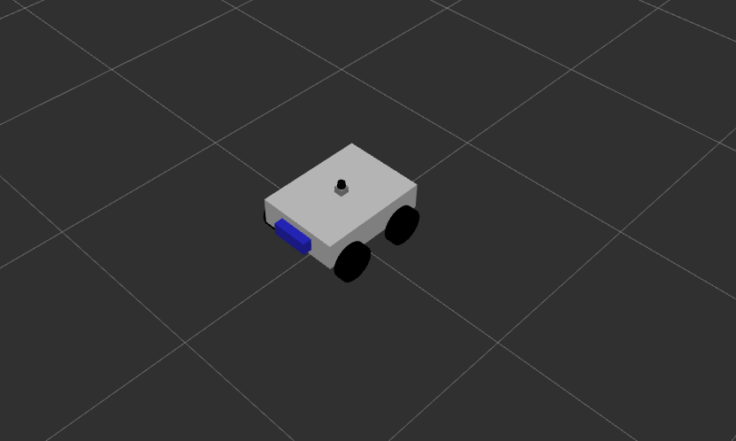
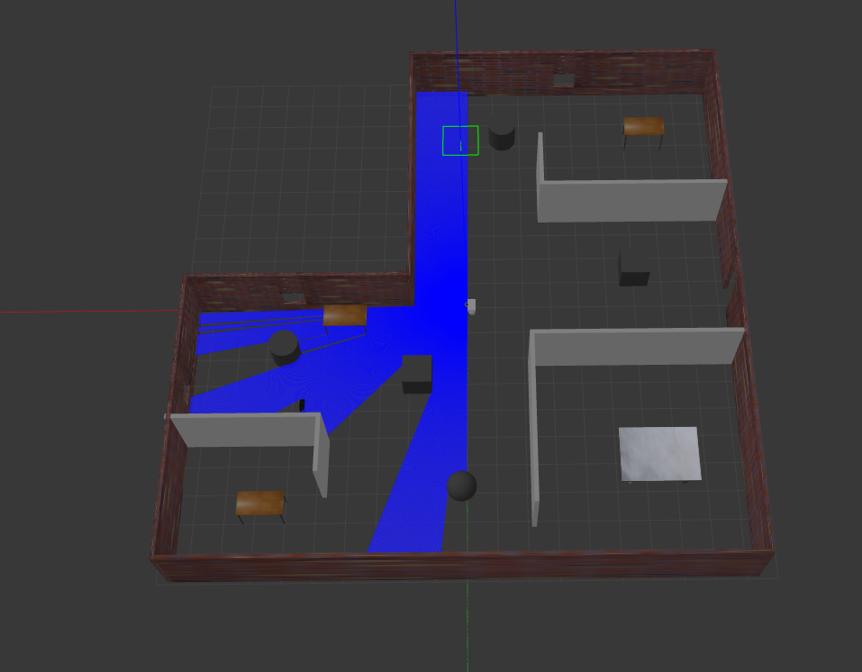
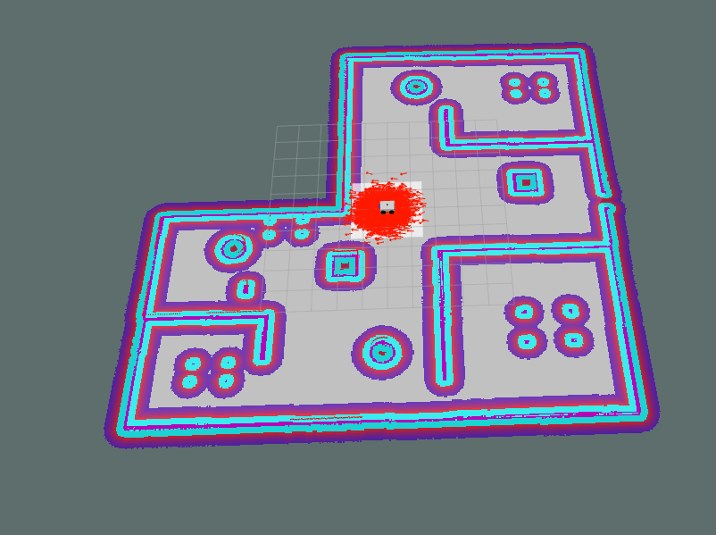
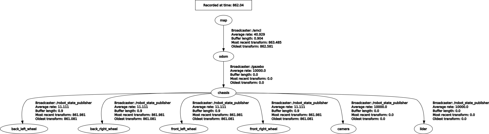

# autonomous_mobile_robot


## Package Name
- robot_description_pkg
- gazebo_pkg
- navigtion_pkg

### robot_description_pkg
- urdf 
- meshes
- worlds

### gazebo_pkg
- launch 


### navigtion_pkg
- launch   
- maps
- param
- rviz


## Description
This Autonomous mobile robot with skid steer drive, i used the Unified Robot Description Format (URDF) to build this robot .

used gmapping package provides laser-based SLAM (Simultaneous Localization and Mapping) to create a 2D occupancy grid map .

AMCL is a probabilistic localization system for a robot moving in 2D.

Navigation stack that takes in information from odometry, sensor streams, and a goal pose and outputs safe velocity commands that are sent to a mobile base,   using the move_base package


## Run robot in gazebo
```
roslaunch gazebo_pkg gazebo.launch 
```

## Create 2D map
```
roslaunch navigtion_pkg gmapping.launch
```

## Save the map
```
 rosrun map_server map_saver 
```
## Run navigtion in Rviz
```
 roslaunch navigtion_pkg navigation.launch
```
this launch have ('Amcl' , 'move_base' , 'Map server' , 'rviz')

------------




------------------


------------------



------------------



